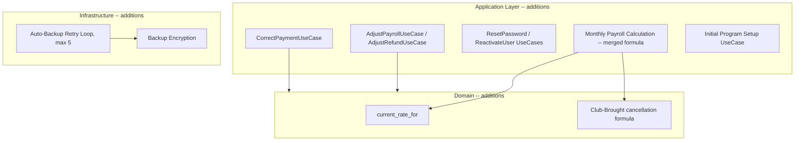

# 03 — System Architecture (SYNCHRONIZED — v2, post Design Closure)
## Swimming Pool Management System

**Depends on:** `01-ERD.md` (v2), `02-Database-Schema.md` (v2). Layered architecture, dependency direction, and technology recommendations are unchanged from the original design except where noted below — this document is not a full rewrite, only the sections touched by the closure decisions.

---

## 1. Unchanged Foundations

The layered structure (UI → Application → Domain → Data Access → Infrastructure), strict downward dependency direction, Unit-of-Work transactional pattern, and the recommended technology stack (local SQLite/embedded Postgres, standard password hashing, QR-as-identification-only) all stand exactly as originally designed. Nothing in the closure decisions changes the architectural style.

## 2. Changes to Layer Responsibilities

### 2.1 Domain Layer — additions
- **Rate resolution function** (finalized decision #6): `current_rate_for(employee_id, as_of_date)` — resolves an employee's highest-ranked `EmployeeQualification` (by `rank_order`) → that qualification's currently-effective `QualificationRateConfig.session_rate`. Pure function, no I/O beyond the two lookups already required.
- **Club-Brought cancellation formula** (finalized decision #2) is now a single, unambiguous pure function: `cancellation_fee = fee_percentage × paid_amount; coach_share = cancellation_fee; refund = paid_amount − cancellation_fee`. This **replaces** the three-branch ambiguity the pre-closure design carried.
- **Ledger sign convention** (Doc02 §14) is enforced here: every calculator that produces a `Transaction`-bound amount returns an already-signed value; the Application layer never re-interprets sign.

### 2.2 Application / Service Layer — additions
- **`CorrectPaymentUseCase`** (finalized decision #22): the one use case permitted to update an already-persisted `Payment.amount` and, atomically, its single linked `Transaction.amount` — implemented as a narrowly-scoped exception to the otherwise-universal "Application layer only INSERTs financial rows" rule. This use case is the **only** caller in the entire system allowed to invoke an `UPDATE` against `transactions`.
- **`AdjustPayrollUseCase` / `AdjustRefundUseCase`** (finalized decisions #23, #24): both insert-only — a single new signed `Transaction` row (`PAYROLL_ADJUSTMENT`/`REFUND_ADJUSTMENT`, `related_entity_id` = the original payroll/refund id). No new table is needed for either; the original `Payroll`/`Refund` row is never touched.
- **`ResetAdministratorPasswordUseCase` / `SelfResetPasswordUseCase`** (finalized decision #16): National-ID identity verification before any password mutation; both outcomes audited.
- **`ReactivateUserUseCase`** (finalized decision #15): toggles `is_active`/`deactivated_at` only; username/password hash untouched.
- **Monthly Payroll Calculation** now aggregates three sources into one formula (finalized decisions #4, #6, #7): Training attendance dues, Replacement dues, and `CoachDue` rows (source_type `CLUB_BROUGHT_SHARE` + `CANCELLATION_FEE`) — see `05-Business-Logic.md` §7 for the full merged formula.
- **Initial Program Setup use case** (new, finalized decision #36): a one-time flow, run before normal login is available on a fresh install, that captures Club Info and seeds `system_settings.language`.

### 2.3 Data Access Layer — additions
- Repositories for every new entity (`QualificationRepository`, `EmployeeQualificationRepository`, `QualificationRateConfigRepository`, `CoachDueRepository`, `RecreationalTicketRepository`, `LaneRepository`, `PrivateBookingParticipantRepository`) — same Unit-of-Work pattern as every existing repository. Payroll/Refund adjustments need **no** new repository beyond the existing `TransactionRepository.insert()` — they are new Transaction rows, not new entities (Decisions 23 & 24).
- `TransactionRepository` gains exactly one additional method beyond `insert()`/read queries: `correctAmount(transaction_id, new_amount)`, callable **only** from `CorrectPaymentUseCase` — not exposed generically.

### 2.4 UI Layer — additions
- **System-wide language, not per-user** (finalized decision #36): the UI layer reads a single `system_settings.system_language` value at startup — there is no per-user language field or in-session toggle anywhere in the application. RTL layout switching is driven by this one setting.
- **Initial Program Setup wizard**: a first-run screen sequence (Club Info + language choice) gating normal app use on a fresh install.
- New/changed screens for: Credit/Outstanding entry (Training/Package creation), Package session-balance display, Guest participant entry (Private), Lane Management (Configuration), Recreational Ticket entry, Password Reset (both flows), User Reactivation, Payroll/Refund Adjustment — see `04-UI-UX-Specification.md` (v2) for full detail.

### 2.5 Infrastructure Layer — additions
- **Backup encryption** (finalized decision #25): the backup component now always encrypts the snapshot before writing to any destination (local/USB/external/network — no exception). Key-management mechanism (passphrase-derived, OS keychain, or key file) is an open **technical** choice — see `10-Backup-Restore-and-Migration.md` §5.
- **Automatic backup retry loop** (finalized decision #26): the scheduler component now retries up to 5 times immediately on failure before declaring the automatic backup failed, logging, and notifying Super Admin persistently.

## 3. Updated Component Diagram (delta)



## 4. Sequence Update — Payment Correction (illustrative, since this is the one true exception to append-only Transactions)

```mermaid
sequenceDiagram
    participant Admin
    participant UC as CorrectPaymentUseCase
    participant Repo
    participant DB

    Admin->>UC: correctPayment(payment_id, new_amount, reason)
    UC->>Repo: load Payment, linked Transaction, parent (Subscription/Package/Booking)
    UC->>Repo: BEGIN
    UC->>Repo: UPDATE payments SET amount=new_amount, last_modified_by, last_modified_at
    UC->>Repo: UPDATE transactions SET amount=new_amount (same signed convention) -- the one sanctioned exception
    UC->>Repo: recompute parent.balance_due (total_price - paid_amount; NOT the separate manual outstanding_declared_amount)
    UC->>Repo: Audit: PAYMENT_CORRECTED {old_amount, new_amount, reason}
    UC->>Repo: COMMIT
```

## 5. Open Technical Question (non-blocking)

Backup encryption key-management scheme (passphrase vs. OS keychain vs. key file) remains an implementation-team technology choice, not a business decision — flagged here so Phase 0 of implementation resolves it explicitly rather than by default/accident.
