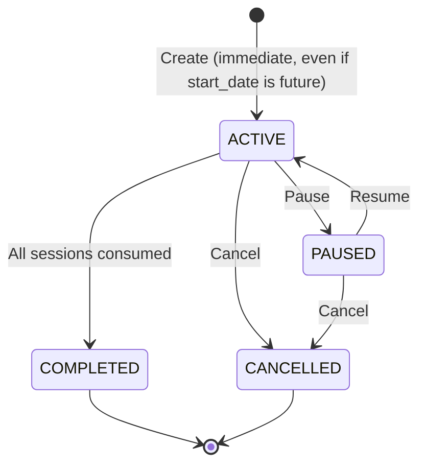
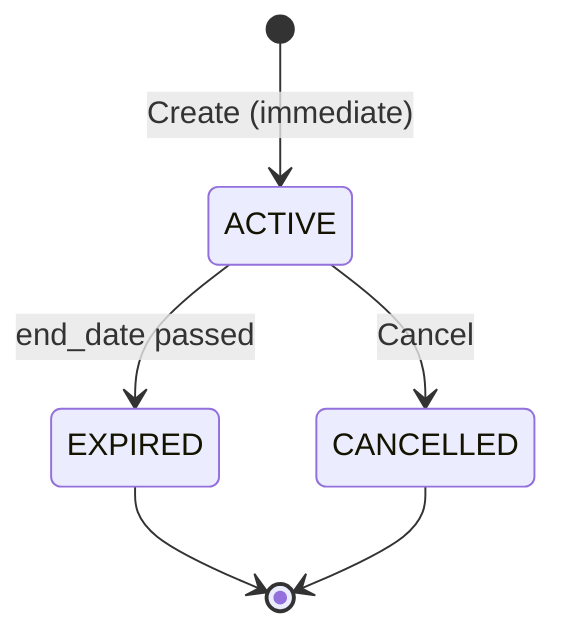
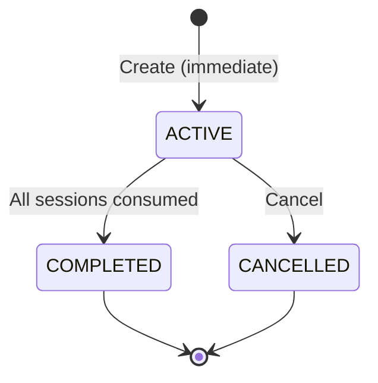
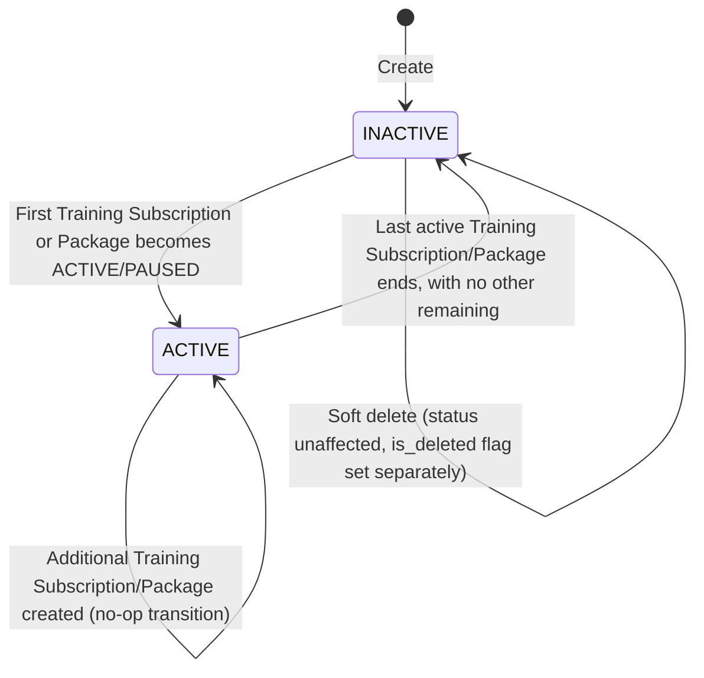
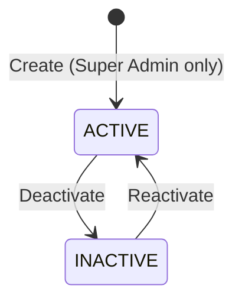
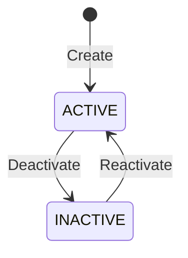
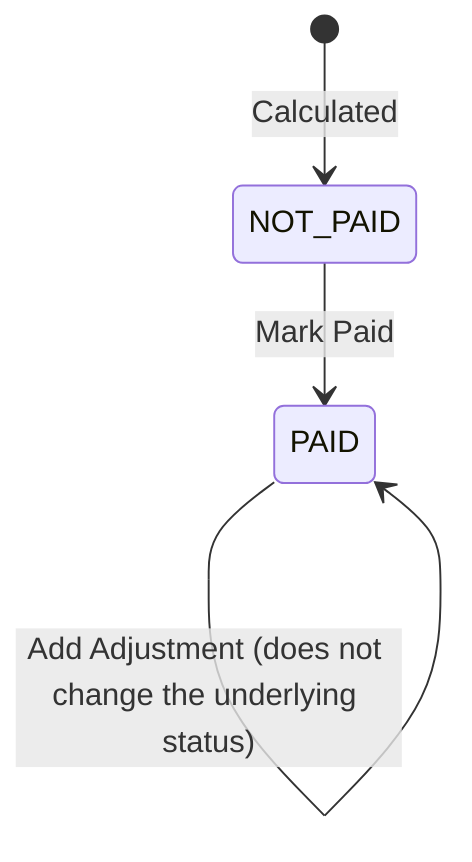
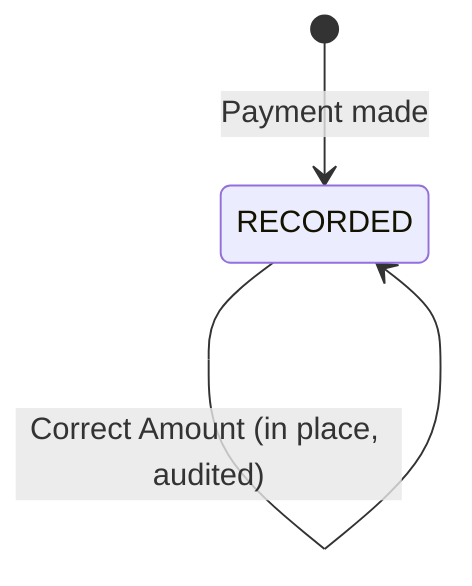
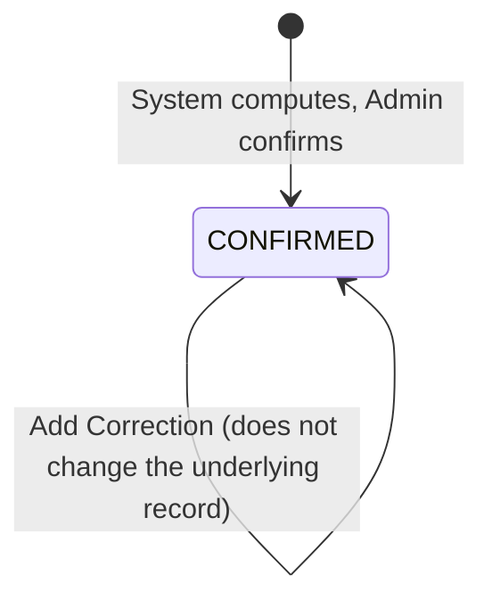
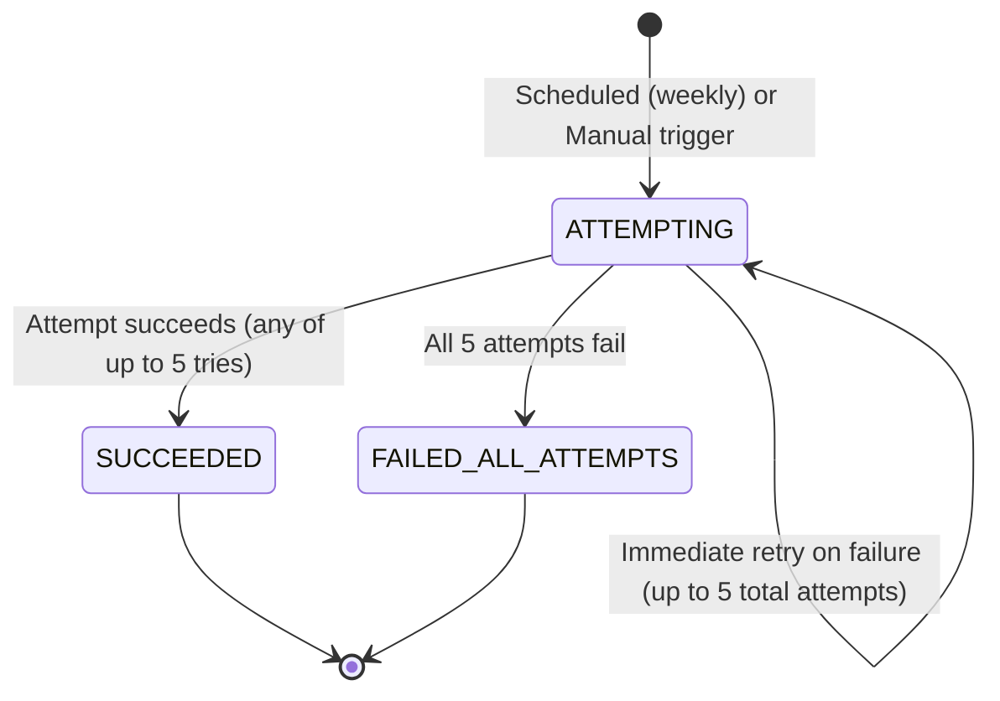

# 07 — State Machines / Lifecycles
## Swimming Pool Management System
### SYNCHRONIZED — supersedes all prior versions of this document

**Depends on:** `05-Business-Logic.md`, `06-Validation-Rules.md` (both synchronized).

Format per transition: `Current State → Event → New State` with Allowed?, Preconditions, Side Effects, Audit Event, Financial Effects.

---

## 1. Training Subscription

**`NEW` and `RENEWED` no longer exist as states (Decisions 28 & 18).** A subscription is `ACTIVE` from the instant it is created, and renewal never forces a status change on the old row.

| Transition | Allowed? | Preconditions | Side Effects | Audit Event | Financial Effects |
|---|---|---|---|---|---|
| `[*] → ACTIVE` | Yes | Creation validated | Sessions generated; Swimmer.status recomputed to ACTIVE; optional Credit grant or Outstanding declaration recorded (Decision 1) | `TRAINING_SUBSCRIPTION_CREATED` | Payment + Transaction if paid_amount > 0 |
| `ACTIVE → PAUSED` | Yes | Current state = ACTIVE | Future sessions → PAUSED status; pause record opened | `SUBSCRIPTION_PAUSED` | None |
| `PAUSED → ACTIVE` | Yes | Current state = PAUSED | Sessions rescheduled from next occurrence; end_date extended; pause record closed | `SUBSCRIPTION_RESUMED` | None |
| `ACTIVE → COMPLETED` | Yes (system-driven) | Last session's scheduled_date has passed | none beyond status flip | `TRAINING_SUBSCRIPTION_COMPLETED` (system) | None |
| **Renewal (not a status transition)** | Yes | Renewal request submitted (Decision 18) | A **brand-new, independent** subscription is created, linked via `renewed_from_subscription_id`. **The old subscription's status is never forced by this event** — it continues to whatever it would naturally reach (COMPLETED, or stays as-is). "Renewed" may appear as a UI badge on the old record, never as a stored status value. | `TRAINING_SUBSCRIPTION_RENEWED` (on the new record) | New subscription's own Payment/Transaction |
| `ACTIVE/PAUSED → CANCELLED` | Yes | Not already Cancelled/Completed | Future sessions → CANCELLED; refund calculated per the before/after-first-session rule; Swimmer.status recomputed | `TRAINING_SUBSCRIPTION_CANCELLED` | Refund + Transaction (before first session) or none (after first session) |
| `COMPLETED/CANCELLED → *` (any other) | **Not allowed** | — | Rejected with "cannot be [action]ed from its current state" | `UNAUTHORIZED_STATE_TRANSITION_ATTEMPT` if attempted via a bypassed client | None |

---

## 2. Package

**`NEW` no longer exists as a state (Decision 28's principle applied uniformly).**

| Transition | Allowed? | Preconditions | Side Effects | Audit Event | Financial Effects |
|---|---|---|---|---|---|
| `[*] → ACTIVE` | Yes | Creation validated | QR issued; session-pool snapshotted (`total_sessions_snapshot`, Decision 5); Swimmer.status recomputed; optional Credit/Outstanding recorded | `PACKAGE_CREATED` | Payment + Transaction if paid |
| `ACTIVE → EXPIRED` | Yes (system-driven) | `today > end_date` | QR becomes invalid; no new check-ins accepted; any remaining session balance is forfeited, never extends validity | `PACKAGE_EXPIRED` (system) | None |
| `ACTIVE → CANCELLED` | Yes | Not already Cancelled/Expired | Refund computed per the before-start / during-first-month (floored at 0) / after-first-month rule (Decision 19); QR invalidated | `PACKAGE_CANCELLED` | Refund + Transaction, or none, per rule |
| **Renewal (not a status transition)** | Yes | §12.6 rule | A **brand-new, independent** Package is created (fresh `total_sessions_snapshot`, own price), linked via `renewed_from_package_id`; old row is untouched, stays whatever it already was (typically EXPIRED) | `PACKAGE_RENEWED` (on the new record) | New package's own Payment/Transaction |
| **Period Change (not a status transition)** | Yes | Status remains ACTIVE throughout | Period reference updated as of change_date; `sessions_consumed`/`total_sessions_snapshot` are untouched and carry forward automatically (Decision 5, explicit) | `PACKAGE_PERIOD_CHANGED` | None |
| Session-pool exhaustion (`sessions_consumed = total_sessions_snapshot`, `today < end_date`) | Not a status transition | — | Package remains `ACTIVE`; further check-ins blocked with "No sessions remaining" | none (not a state change, just a check-in rejection) | None |
| **No `Pause` transition exists** | By design | — | — | — | — |

---

## 3. Private Booking

**`NEW` no longer exists as a state (Decision 28's principle applied uniformly).**

| Transition | Allowed? | Preconditions | Side Effects | Audit Event | Financial Effects |
|---|---|---|---|---|---|
| `[*] → ACTIVE` | Yes | Coach/lane(with capacity)/schedule validated; participants recorded as Swimmer or Guest (Decision 9) | Sessions generated; for Club-Brought, an initial `CoachDue(CLUB_BROUGHT_SHARE)` row is accrued for the coach (Decision 4) | `PRIVATE_BOOKING_CREATED` | Payment + Transaction per business-type pricing |
| `ACTIVE → COMPLETED` | Yes (system-driven) | All sessions consumed | none | `PRIVATE_BOOKING_COMPLETED` (system) | None |
| `ACTIVE → CANCELLED` | Yes | Not already Cancelled/Completed | Refund tiered by sessions-completed & business type; for Club-Brought, the fully-resolved cancellation-fee formula applies (100% of fee → Coach via `CoachDue(CANCELLATION_FEE)`, remainder refunded, club retains nothing — Decision 2), with an offsetting entry against any already-accrued `CLUB_BROUGHT_SHARE` for the same booking | `PRIVATE_BOOKING_CANCELLED` | Refund + Transaction; CoachDue ledger entries (no direct customer-facing coach payout) |

---

## 4. Swimmer (derived state, not user-driven)

**Private Bookings are now explicitly and permanently excluded from this computation (Decision 20 — no longer "pending").**

| Transition | Allowed? | Preconditions | Side Effects | Audit Event | Financial Effects |
|---|---|---|---|---|---|
| `INACTIVE → ACTIVE` | System-derived | A linked Training Subscription or Package reaches `ACTIVE`/`PAUSED`. **Private Bookings, in any state, never trigger this.** | none beyond the flag | Not separately audited (parent operation's audit entry covers it) | None |
| `ACTIVE → INACTIVE` | System-derived | Zero remaining Training Subscriptions/Packages in `ACTIVE`/`PAUSED` state, **regardless of any Private Booking activity** | none beyond the flag | Not separately audited | None |
| Soft delete | User-driven, orthogonal to Active/Inactive | No active Training Subscription/Package (an active Private Booking never blocks this) | `is_deleted=TRUE` | `SWIMMER_SOFT_DELETED` | None |

A swimmer with only ever Private Bookings is **permanently `INACTIVE`** by this system's definition — this is a deliberate, confirmed business rule (Decision 20), not an oversight.

---

## 5. Training/Recreational Period

**Editing authority now fully resolved (Decision 14).**

| Transition | Allowed? | Preconditions | Side Effects | Audit Event | Financial Effects |
|---|---|---|---|---|---|
| `ACTIVE → INACTIVE` | Yes | Actor = Super Admin or Administrator (both now confirmed eligible) | Not available for new subscriptions/packages/check-ins; historical subscriptions remain linked | `TRAINING_PERIOD_DEACTIVATED` | None |
| `INACTIVE → ACTIVE` | Yes | Actor = Super Admin or Administrator | Available again for new enrollments | `TRAINING_PERIOD_REACTIVATED` | None |
| Schedule/capacity/staff change (not a status transition) | Yes | Actor = Super Admin or Administrator (Owner is view-only, never edits) | Past sessions untouched; future sessions/new enrollments use the new schedule, regardless of which of the two eligible roles made the change | `TRAINING_PERIOD_SCHEDULE_CHANGED` | None |

---

## 6. Employee

| Transition | Allowed? | Preconditions | Side Effects | Audit Event | Financial Effects |
|---|---|---|---|---|---|
| `ACTIVE → INACTIVE` | Yes | **Who exactly holds this authority remains genuinely open** (Doc12 item A7 — not addressed by any closure decision; distinct from deactivating the linked User login, which follows the clear §4.2 role rules). Working assumption pending confirmation: Administrator, as part of daily operational Employee management. | Cannot be newly assigned to Periods/Private bookings going forward; historical assignments/payroll/`CoachDue` rows remain intact | `EMPLOYEE_DEACTIVATED` | None (past payroll unaffected) |
| `INACTIVE → ACTIVE` | Yes | Same authority as above | Employee becomes assignable again | `EMPLOYEE_REACTIVATED` | None |

---

## 7. User

**Reactivation is now confirmed (Decision 15 — resolves the earlier open question).**

| Transition | Allowed? | Preconditions | Side Effects | Audit Event | Financial Effects |
|---|---|---|---|---|---|
| `ACTIVE → INACTIVE` | Yes | Actor per the fixed role rules (Super Admin: any user; Owner: Administrator-role users only) | Login blocked immediately; all historical FK references remain resolvable | `USER_DEACTIVATED` | None |
| `INACTIVE → ACTIVE` | Yes | Same actor authority as deactivation | Login restored; `username` and `password_hash` **both preserved unchanged**, no forced reset; full history intact | `USER_REACTIVATED` | None |

---

## 8. Payroll

**Correction mechanism now fully resolved (Decision 23 — replaces the earlier open question).**

| Transition | Allowed? | Preconditions | Side Effects | Audit Event | Financial Effects |
|---|---|---|---|---|---|
| `(none) → NOT_PAID` | System-driven | Monthly payroll calculation runs (confirmed monthly for all employee types — Decision 7) | `payrolls` row created with `calculated_amount` (Training + Replacement + `CoachDue` sources for Coach/Lifeguard; salary-minus-absence for Administrator) | `PAYROLL_CALCULATED` (system) | None yet |
| `NOT_PAID → PAID` | Yes | Actor = Super Admin, Owner, or Administrator (all three, unusually) | `payment_date` set; `Transaction(PAYROLL_PAYMENT)` created | `PAYROLL_MARKED_PAID` | Transaction created |
| **`PAID` row is now PERMANENTLY LOCKED — no reversal to `NOT_PAID`, no in-place edit, ever (Decision 23)** | — | — | — | — | — |
| Add Adjustment (does not change `status`) | Yes | Payroll is `PAID` | A brand-new `Transaction(PAYROLL_ADJUSTMENT, signed amount, related_entity_id=payroll_id)` — no new Payroll row, no edit to the original | `PAYROLL_ADJUSTED` | Transaction created; Payroll Report sums original + all adjustments |

---

## 9. Payment

**No longer purely immutable — one narrow, explicit correction path now exists (Decision 22).**

Each `Payment` row is recorded once, but — unlike every other financial entity in this system — **its `amount` can be directly corrected by an Administrator**, with the linked Transaction updated to match in the same operation (the one sanctioned exception to Transaction immutability across the whole design, see `01-ERD.md` §1.23). Every correction is audited with old amount, new amount, actor, timestamp, and reason. There is no separate correction-transaction mechanism for Payments the way there is for Payroll/Refund — the row itself is updated directly, per the closure decision's explicit text ("no separate correction transaction is required").

---

## 10. Refund

**Correction mechanism now fully resolved (Decision 24), mirroring Payroll's pattern exactly.**

| Transition | Allowed? | Preconditions | Side Effects | Audit Event | Financial Effects |
|---|---|---|---|---|---|
| `(none) → CONFIRMED` | Yes | Cancellation event computes the refund amount; Administrator confirms only, never edits the number | `refunds` row + `Transaction(REFUND)` created | `REFUND_CONFIRMED` | Transaction created |
| **`CONFIRMED` row is now PERMANENTLY LOCKED — no in-place edit, ever (Decision 24)** | — | — | — | — | — |
| Add Correction (does not change the original record) | Yes | Refund is `CONFIRMED` | A brand-new `Transaction(REFUND_ADJUSTMENT, signed amount, related_entity_id=refund_id)` — no edit to the original `refunds` row or its original `REFUND` Transaction | `REFUND_ADJUSTED` | Transaction created |

---

## 11. Backup

| Transition | Allowed? | Preconditions | Side Effects | Audit Event | Financial Effects |
|---|---|---|---|---|---|
| `ATTEMPTING → SUCCEEDED` | System-driven | Backup write succeeds, on attempt 1–5 | Encrypted snapshot written; `backups` row inserted (Decision 25) | `BACKUP_CREATED_AUTO` / `BACKUP_CREATED_MANUAL` | None |
| `ATTEMPTING → FAILED_ALL_ATTEMPTS` | System-driven | All 5 attempts fail (Decision 26) | Super Admin notified persistently; system continues operating normally; Manual Backup required | `BACKUP_FAILED_ALL_ATTEMPTS` | None |

---

## 12. Cross-Entity State Coupling Summary

| When this happens... | ...this also changes |
|---|---|
| Training Subscription or Package reaches ACTIVE (first one for a swimmer) | Swimmer.status → ACTIVE |
| Training Subscription/Package's status leaves ACTIVE/PAUSED with none remaining | Swimmer.status → INACTIVE (Private Bookings never factor in, either direction) |
| Training/Recreational Period schedule changes (by Super Admin or Administrator) | Future Sessions use new schedule; past Sessions untouched |
| Package renewed | Old Package stays whatever it already was (untouched); new Package created independently with its own fresh session pool |
| Package Period Change | Session balance (`sessions_consumed`/`total_sessions_snapshot`) carries forward on the same Package row, untouched by the Period reference change |
| Training Subscription cancelled | All future Sessions → CANCELLED; Refund/Transaction created conditionally |
| Employee replaced for one session | Base `PeriodStaffAssignment` unchanged; only that session's `EmployeeAttendance`/`EmployeeReplacement` reflect the substitution |
| Club-Brought Private booking created | One `CoachDue(CLUB_BROUGHT_SHARE)` row accrued for the coach |
| Club-Brought Private booking cancelled | One `CoachDue(CANCELLATION_FEE)` row accrued; an offsetting negative entry cancels out any already-accrued ordinary share for the same booking |
| Payroll marked Paid | Transaction ledger gains one `PAYROLL_PAYMENT` row; consumed `CoachDue` rows are stamped with this `payroll_id` so they are never summed into a later payroll run |
| Payroll/Refund corrected after lock | A new `PAYROLL_ADJUSTMENT`/`REFUND_ADJUSTMENT` Transaction is added; the original row is never touched |
| Payment corrected | Both the `payments` row and its one linked `transactions` row are updated together, in the same operation (the sole exception to Transaction immutability) |
