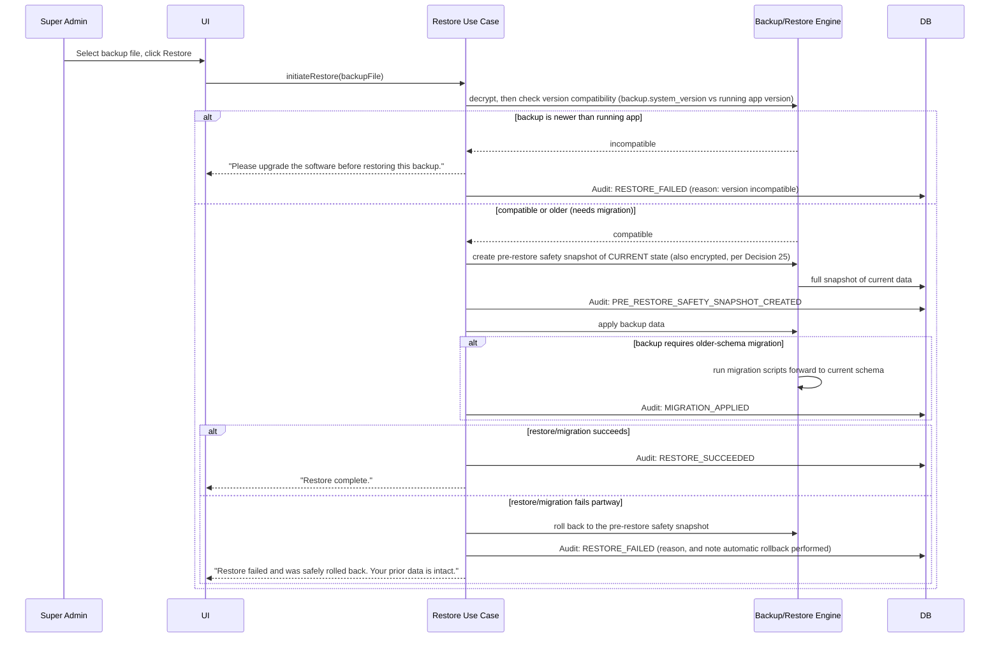

# 10 — Backup, Restore & Migration Design (SYNCHRONIZED — supersedes all prior versions of this document)
## Swimming Pool Management System

**Depends on:** `02-Database-Schema.md`, `03-System-Architecture.md`, `09-Audit-Log.md` (all synchronized).

---

## 1. Automatic Weekly Backup

- A scheduled job, running inside the Infrastructure layer, fires once per week while the application is installed/running. What happens if the app isn't running at the scheduled time remains a genuinely open, low-priority technical question — recommend "run on next launch if the last auto-backup is more than 7 days old."
- **Retry and failure handling is now fully specified (Decision 26 — resolves the earlier open question entirely):**
  ```
  attempt = 1
  WHILE attempt <= 5:
      result = try_create_backup()
      IF result.success: insert backups row (type=AUTO, encrypted=TRUE); audit BACKUP_CREATED_AUTO; DONE
      ELSE: attempt += 1   -- immediate retry, no described backoff delay
  IF attempt > 5 (all 5 failed):
      audit BACKUP_FAILED_ALL_ATTEMPTS (system, details={attempts:5})
      surface a PERSISTENT warning to Super Admin (until acknowledged or a successful Manual Backup occurs)
      system continues operating normally -- never blocks normal use
      Manual Backup is now explicitly required as the fallback
  ```

## 2. Manual Backup

- Super Admin only, on-demand, from the Backup screen.
- Destination options: local folder, USB, external drive, network folder. The Infrastructure layer's backup component works against arbitrary filesystem-mounted paths, not a single fixed backup directory.
- Same encryption and Audit Log entry (`BACKUP_CREATED_MANUAL`) as automatic backup — a manual backup gets **one** attempt shown synchronously to the Super Admin (not the 5-attempt retry loop, which applies specifically to the unattended automatic schedule); on failure, the Super Admin sees the error immediately and can retry manually.

## 3. Retention Policy

- Maximum 7 backups retained **in total**, across both AUTO and MANUAL types combined.
- On each successful backup creation, after insert: `IF COUNT(backups) > 7 THEN DELETE the row with the oldest created_at, AND delete its underlying file/artifact at destination_path`.
- Write `BACKUP_RETENTION_PRUNED` to Audit Log identifying which backup was removed.
- Orphaned backup file handling on disconnected removable media during pruning remains a genuinely open, low-priority technical question (not addressed by any closure decision) — recommend deleting the metadata row regardless (so retention count logic stays correct) and logging a warning that the physical file may need manual cleanup.

## 4. Backup Content, Metadata & Encryption

- Each backup is a **complete snapshot**: full database file/dump plus a metadata sidecar recording `system_version`, `created_at`, `type`, `size_bytes`, `attempt_number`.
- **Encryption is now mandatory for every backup, without exception (Decision 25 — resolves the earlier open question entirely).** Every backup — automatic or manual, on every destination type — is encrypted before being written. A backup is never readable or restorable outside this system's own controlled Restore mechanism; there is no "export as plain files" mode.
- The snapshot includes everything restorable per §5 below — there is no partial/selective backup mode.

## 5. Key-Management Approach for Backup Encryption (technical decision, resolves narrow flag N5/T-3)

Decision 25 establishes the *requirement* (encrypt everything); it does not specify a mechanism, and this is correctly treated as a technical choice rather than a reopened business question, since the choice below changes no business-visible behavior:

**Adopted approach:** a system-generated symmetric encryption key is created during Initial Program Setup (alongside the language choice, Decision 36) and stored using the host OS's secure credential store where available (Windows DPAPI / macOS Keychain / a permissioned local key file as the cross-platform fallback), referenced from each `backups` row via `encryption_key_ref`. This avoids requiring the Super Admin to remember or manage a passphrase (which they could lose, permanently orphaning old backups), while still ensuring a backup file copied off the machine (e.g., to USB) is unreadable without the original machine's key store. `DECISION REQUIRED (very low priority, technical)`: if the club ever needs to restore a backup onto **replacement hardware** (the original machine is lost/destroyed), a pure OS-keychain-only approach would make old backups unrecoverable — the implementation team should decide whether to also support an optional, Super-Admin-exported recovery key for disaster-recovery purposes. This does not block starting implementation of any module.

## 6. Restore

- Super Admin only. Restore decrypts as its first step (§4), before version-compatibility checking.
- Restore is a **full replacement** of current data with the backup's contents: database records, Users, Configuration, Transactions, Attendance, Payroll, Audit Log, Swimmers, Employees, Subscriptions, `CoachDue` ledger, Qualifications, Lanes, and all other application state.
- There is no selective/partial restore mode — comprehensive restore avoids referential-integrity risk across the historical-truth guarantees this whole system is built on.

### 6.1 Restore Sequence (Safe Restore)



## 7. Version Compatibility & Migration

- **Rule:** a backup created by a **newer** software version than the one currently running **cannot** be restored — checked and blocked before any data is touched.
- **Rule:** a backup created by an **older** compatible version restoring into a newer version runs the migration chain forward.
- Precise versioning/compatibility scheme (strict semver vs. an explicit compatibility table) remains a genuinely open technical decision, not addressed by any closure decision — needed before the migration-runner component can be built with confidence, but does not block starting implementation of any other module.

## 8. Failed Migration Recovery

- Directly covered by the Safe Restore sequence in §6.1 — any failure during migration triggers automatic rollback to the pre-operation snapshot.
- The migration step and the "commit as current data" step should be treated as one atomic unit-of-work at the Infrastructure level (migrate into a staging copy, then swap) — a technical decision for robustness.

## 9. Summary Table

| Concern | Status |
|---|---|
| Weekly automatic backup | GREEN |
| Manual backup, multiple destination types | GREEN |
| 7-backup retention, FIFO | GREEN |
| Backup metadata (version, timestamp, type, attempt number) | GREEN |
| Full-snapshot restore scope | GREEN |
| Newer-backup-blocked rule | GREEN |
| Older-backup-migrates rule | GREEN |
| Safe-restore (pre-restore snapshot) | GREEN |
| **Backup encryption at rest** | **GREEN — fully resolved (Decision 25)** |
| **Automatic backup retry & failure notification** | **GREEN — fully resolved (Decision 26)** |
| Precise versioning/compatibility scheme | YELLOW — technical decision, needed before migration-runner build |
| App-not-running auto-backup behavior | YELLOW — technical decision |
| Orphaned backup file on missing removable media | YELLOW — technical decision |
| Encryption key-management mechanism | YELLOW — technical decision, adopted approach in §5, disaster-recovery variant still open |
| Selective/partial restore | GREEN (out of scope by default) |
