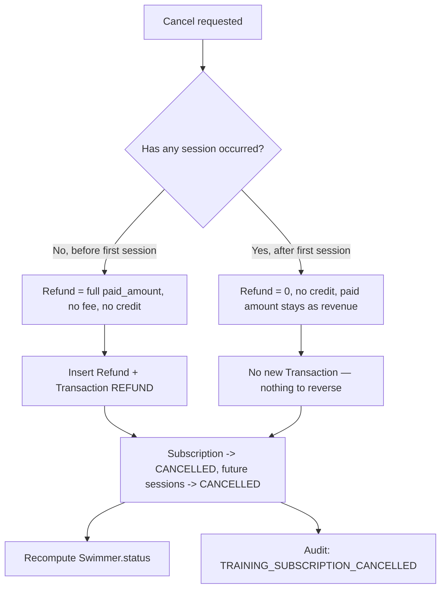
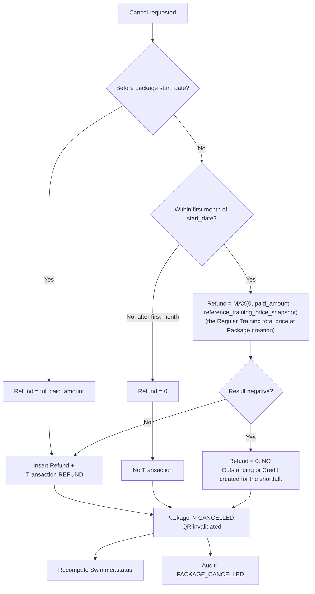
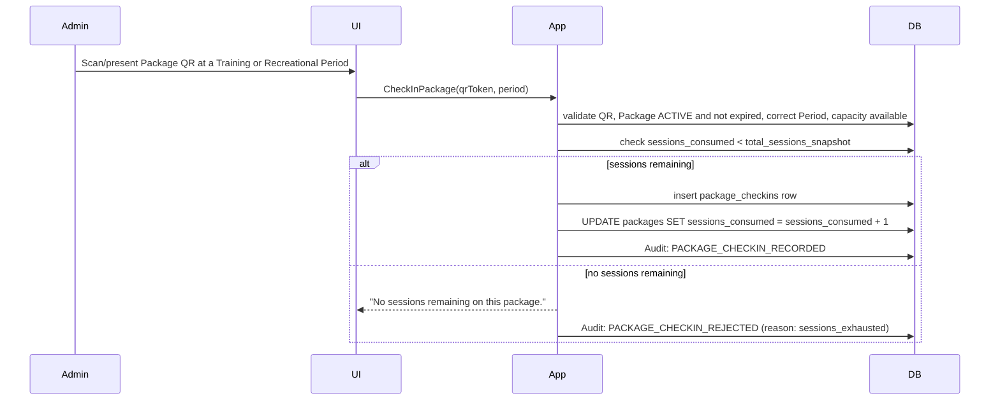
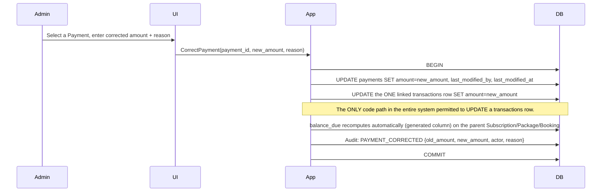

# 11 — Cross-Module Workflows
## Swimming Pool Management System
### SYNCHRONIZED — supersedes all prior versions of this document

**Depends on:** all prior documents (01–10, synchronized). This document ties them together into end-to-end sequences and closes with the Financial Integrity Appendix, now rewritten in full against the finalized closure decisions.

---

## 1. Training Subscription — Full Lifecycle

```mermaid
sequenceDiagram
    participant Admin as Administrator
    participant UI
    participant App as Application Layer
    participant DB

    Admin->>UI: Search/select Swimmer, choose Program+Period, set Start Date, enter Paid Amount, optionally grant Credit or declare Outstanding
    UI->>App: CreateTrainingSubscription(...)
    App->>DB: validate capacity, overlap, date rules
    App->>DB: snapshot flat total price + session count (Decision 3)
    App->>DB: BEGIN transaction
    App->>DB: insert Subscription (status=ACTIVE immediately, Decision 28), generate Sessions
    App->>DB: insert Payment, insert Transaction(TRAINING_PAYMENT)
    App->>DB: IF credit_granted_amount provided: insert Credit row, Audit CREDIT_ISSUED (Decision 1)
    App->>DB: IF outstanding_declared_amount provided: store the declared annotation (additive to balance_due)
    App->>DB: recompute Swimmer.status = ACTIVE
    App->>DB: Audit: TRAINING_SUBSCRIPTION_CREATED
    App->>DB: COMMIT
    App-->>UI: Subscription created, balance_due = total - paid (always shown, unconditionally)

    loop Each scheduled Session
        Admin->>UI: Open Period on session date, within the ±30-minute attendance window (Decision 29)
        Admin->>UI: Record attendance (manual or QR)
        UI->>App: RecordAttendance(session, swimmer, status)
        App->>DB: validate QR/session/subscription match and window
        App->>DB: insert Attendance
        App->>DB: Audit: ATTENDANCE_RECORDED
    end

    alt Subscription runs to completion
        App->>DB: (system) Subscription -> COMPLETED
    else Swimmer requests Cancellation
        Admin->>UI: Cancel Subscription
        UI->>App: CancelTrainingSubscription(id)
        App->>DB: determine before/after-first-session rule
        App->>DB: compute refund (0 or full paid amount)
        App->>DB: insert Refund + Transaction(REFUND) if applicable
        App->>DB: Subscription -> CANCELLED; future Sessions -> CANCELLED
        App->>DB: recompute Swimmer.status
        App->>DB: Audit: TRAINING_SUBSCRIPTION_CANCELLED
    else Swimmer requests Renewal
        Admin->>UI: Renew Subscription
        UI->>App: RenewTrainingSubscription(oldId)
        App->>DB: compute new start date per the two-branch rule (Decision 18)
        App->>DB: create new independent Subscription (own price/session snapshot, priced at CURRENT config as of this moment)
        App->>DB: link renewed_from_subscription_id -- the OLD subscription's status is never force-changed
        App->>DB: Audit: TRAINING_SUBSCRIPTION_RENEWED (on the new record)
    end
```

## 2. Training Cancellation — Decision Detail



## 3. Package Cancellation — Decision Detail (Decision 19)



Note: the "first month" boundary day itself remains genuinely open (Doc12 item D-4). The `reference_training_price_snapshot` field is captured on `packages` at creation specifically to make this formula computable without ever re-reading potentially-changed current configuration.

## 4. Package Session Consumption (new workflow, Decision 5)


This produces **no Transaction of any kind** — the Package's price was already fully recognized as revenue at creation (§8.1 below); consumption is a usage event, not a financial event.

## 5. Private Booking — Full Lifecycle (Club-Brought cancellation now fully resolved, Decision 2)

```mermaid
sequenceDiagram
    participant Admin
    participant UI
    participant App
    participant DB

    Admin->>UI: Choose business type, Coach, Lane (with capacity check), participants (Swimmer or Guest), schedule, pricing inputs
    UI->>App: CreatePrivateBooking(...)
    App->>DB: validate coach conflict, lane conflict + capacity (Decision 30)
    App->>DB: snapshot pricing fields per business type; for Club-Brought, freeze club/coach percentages (Decision 8)
    App->>DB: BEGIN
    App->>DB: insert PrivateBooking (status=ACTIVE immediately), generate Sessions, insert participant rows
    App->>DB: insert Payment, Transaction(PRIVATE_PAYMENT)
    App->>DB: IF Club-Brought: insert CoachDue(CLUB_BROUGHT_SHARE, amount=coach_share) -- Decision 4
    App->>DB: Audit: PRIVATE_BOOKING_CREATED
    App->>DB: COMMIT

    loop Each session
        Admin->>UI: Coach reports attendance verbally; Administrator records it
        UI->>App: RecordPrivateAttendance(session, participant(s), status)
        App->>DB: insert Attendance (method=MANUAL, no QR path)
    end

    alt Completed naturally
        App->>DB: (system) Booking -> COMPLETED
    else Cancelled -- Lane Rental / Coach-Brought
        Admin->>UI: Cancel Booking
        UI->>App: CancelPrivateBooking(id)
        App->>DB: count completed sessions, determine tier (before-first / before-2nd / after-2nd)
        App->>DB: compute refund per tier
        App->>DB: insert Refund + Transaction(REFUND) as applicable
        App->>DB: Booking -> CANCELLED
        App->>DB: Audit: PRIVATE_BOOKING_CANCELLED
    else Cancelled -- Club-Brought (fully resolved, Decision 2)
        Admin->>UI: Cancel Booking
        UI->>App: CancelPrivateBooking(id)
        App->>DB: cancellation_fee = paid_amount x configured_fee_percentage
        App->>DB: insert CoachDue(CANCELLATION_FEE, amount=cancellation_fee) -- 100% of the fee, to the Coach
        App->>DB: insert offsetting NEGATIVE CoachDue(CLUB_BROUGHT_SHARE) if one was already accrued at creation
        App->>DB: insert Refund(paid_amount - cancellation_fee) + Transaction(REFUND)
        Note over App,DB: The ordinary club/coach split is NEVER used here. Club retains nothing.
        App->>DB: Booking -> CANCELLED
        App->>DB: Audit: PRIVATE_BOOKING_CANCELLED
    end
```

## 6. Recreational Entry (Single Entry now a standalone ticket, Decisions 10 & 11)

```mermaid
sequenceDiagram
    participant Admin
    participant UI
    participant App
    participant DB

    alt Single Entry (ticket-based, no Swimmer link)
        Admin->>UI: Enter Name, Member/Non-Member, confirm full payment
        UI->>App: RecordRecreationalTicket(period, name, member_status, amount)
        App->>DB: check check-in window (+/-30min)
        App->>DB: check capacity
        App->>DB: check amount == configured full entry fee (no partial payment accepted)
        App->>DB: check for a duplicate (period, name, date) -- Decision 31
        alt no duplicate
            App->>DB: insert recreational_tickets row
            App->>DB: insert Transaction(RECREATIONAL_TICKET_PAYMENT)
            App->>DB: Audit: RECREATIONAL_TICKET_RECORDED
        else duplicate found
            App-->>UI: "[Name] has already checked in for this session."
            App->>DB: Audit: RECREATIONAL_DUPLICATE_CHECKIN_REJECTED
        end
    else Package Holder (unaffected by the Single Entry redesign)
        Admin->>UI: Scan QR
        UI->>App: ValidateAndCheckIn(qrToken, period)
        App->>DB: validate Package Active, not expired, correct period, capacity, sessions remaining
        alt valid
            App->>DB: insert package_checkins row; decrement sessions_consumed
            App->>DB: Audit: PACKAGE_CHECKIN_RECORDED
        else invalid
            App-->>UI: specific rejection reason
            App->>DB: Audit: PACKAGE_CHECKIN_REJECTED
        end
    end
```

## 7. Payroll (now a merged three-source monthly calculation, Decisions 4, 6, 7)

```mermaid
sequenceDiagram
    participant System
    participant App
    participant DB
    participant Actor as Super Admin / Owner / Administrator

    System->>App: Run monthly payroll calculation (all employee types, same cadence -- Decision 7)
    App->>DB: for Coach/Lifeguard: sum(qualification-tier rate x sessions PRESENT, Training)
    App->>DB: + sum(rate_applied_snapshot for sessions covered as Replacement)
    App->>DB: + sum(CoachDue rows WHERE consumed_in_payroll_id IS NULL, this employee/period)
    App->>DB: for Administrator: monthly_salary - (absent_days x daily_value) -- unchanged
    App->>DB: insert Payroll row (status=NOT_PAID)
    App->>DB: UPDATE consumed CoachDue rows: SET consumed_in_payroll_id = this payroll's id
    App->>DB: Audit: PAYROLL_CALCULATED (system)

    Actor->>App: Mark Payroll Paid
    App->>DB: BEGIN
    App->>DB: update Payroll.status = PAID, payment_date = today
    App->>DB: insert Transaction(PAYROLL_PAYMENT, negative amount)
    App->>DB: Audit: PAYROLL_MARKED_PAID
    App->>DB: COMMIT

    opt Correction needed after PAID (Decision 23)
        Actor->>App: Add Adjustment(payroll_id, amount, reason)
        App->>DB: insert Transaction(PAYROLL_ADJUSTMENT, signed amount, related_entity_id=payroll_id)
        Note over App,DB: Original Payroll row and its PAYROLL_PAYMENT transaction are NEVER touched.
        App->>DB: Audit: PAYROLL_ADJUSTED
    end
```

## 8. Payment Correction (new workflow, Decision 22)



## 9. Backup (encryption and retry now fully specified, Decisions 25 & 26)

```mermaid
sequenceDiagram
    participant Trigger as Scheduler / Super Admin
    participant App
    participant Infra
    participant DB

    Trigger->>App: Backup requested (auto weekly, up to 5 attempts; or manual, single attempt)
    App->>Infra: create ENCRYPTED full snapshot at destination
    Infra-->>App: success/failure + size/version metadata
    alt success
        App->>DB: insert backups row (encrypted=TRUE)
        App->>DB: Audit: BACKUP_CREATED_AUTO / _MANUAL
        App->>App: if count > 7, prune oldest
    else failure (automatic path, attempt < 5)
        App->>App: immediate retry
    else failure (automatic path, all 5 attempts exhausted)
        App->>DB: Audit: BACKUP_FAILED_ALL_ATTEMPTS
        App-->>Trigger: persistent Super Admin notification; system continues operating; Manual Backup required
    else failure (manual path)
        App-->>Trigger: immediate error shown; Super Admin may retry manually
    end
```

---

## 10. Financial Integrity Appendix — Fully Rewritten

**This section is the authoritative answer to "how does the system prevent double-counting or incorrect revenue," and directly satisfies the requirement that Revenue must never be computed as a naive `SUM(all positive transactions)`.** Revenue is always computed by explicit `transaction_type` classification, never by sign alone.

### 10.1 Transaction Type → Financial Meaning Classification Table

| `transaction_type` | Sign | Counts toward Revenue? | Counts toward Expenses? | Notes |
|---|---|---|---|---|
| `TRAINING_PAYMENT` | + | ✅ Yes | No | |
| `PACKAGE_PAYMENT` | + | ✅ Yes | No | Recognized in full at Package creation — session consumption (§4 above) is not a separate financial event |
| `PRIVATE_PAYMENT` | + | ✅ Yes | No | |
| `RECREATIONAL_TICKET_PAYMENT` | + | ✅ Yes | No | (renamed from `RECREATIONAL_ENTRY`, Decisions 10 & 11) |
| `OUTSTANDING_PAYMENT` | + | ✅ Yes | No | A later payment against an existing balance — same revenue treatment as the original payment type, classified separately only for reporting granularity |
| `CREDIT_USAGE` | + | ✅ Yes, **on the date of use** | No | **Never** counted as revenue at Credit-grant time (§10.4) |
| `REFUND` | − | **Reduces** Revenue in the period it occurs | No | Never edits the original payment's Transaction |
| `REFUND_ADJUSTMENT` | ± | **Adjusts** Revenue in the period it occurs | No | New (Decision 24) |
| `EXPENSE` | − | No | ✅ Yes | |
| `PAYROLL_PAYMENT` | − | No | ✅ Yes | |
| `PAYROLL_ADJUSTMENT` | ± | No | ✅ Adjusts Expenses | New (Decision 23) |

**Explicit formula (never naive summation):**
```
Revenue(period)  = SUM(amount) WHERE transaction_type IN
                   ('TRAINING_PAYMENT','PACKAGE_PAYMENT','PRIVATE_PAYMENT',
                    'RECREATIONAL_TICKET_PAYMENT','OUTSTANDING_PAYMENT',
                    'CREDIT_USAGE','REFUND','REFUND_ADJUSTMENT')
                   AND created_at IN period
                   -- REFUND/REFUND_ADJUSTMENT carry negative/signed amounts, so they net out
                   -- automatically within this classified sum -- they are never a separate
                   -- "subtract this too" step bolted onto a naive SUM(all positive rows).

Expenses(period) = ABS(SUM(amount)) WHERE transaction_type IN
                   ('EXPENSE','PAYROLL_PAYMENT','PAYROLL_ADJUSTMENT')
                   AND created_at IN period

Profit(period)   = Revenue(period) - Expenses(period)
```
Payment correction (Decision 22) never breaks this formula because the linked Transaction is updated in place to match — the classification and the ledger total stay consistent by construction, not by a separate reconciliation step.

### 10.2 Payments → Transactions
Every `Payment` insert is followed, **in the same database transaction**, by exactly one `Transaction` insert. There is no code path that creates a Payment without its Transaction, and none that creates one of these Transaction types without a backing Payment — enforced by a single `RecordPayment` use case that does both atomically. **Exception:** `CorrectPayment` (Decision 22, §8 above) may subsequently update both rows together — this is the one place a Payment/Transaction pair is mutated after creation, and it updates both halves in lockstep, never one without the other.

### 10.3 Refunds → Revenue
A `Refund` produces a `Transaction` with a **negative** amount and type `REFUND`. Because Revenue is computed by explicit classification (§10.1), a negative Refund transaction nets against the original positive payment transaction **in whatever period the refund occurs**, without ever mutating or deleting the original Payment/Transaction. A **confirmed Refund is then permanently locked** (Decision 24) — any further correction is a brand-new `REFUND_ADJUSTMENT` Transaction, never an edit to the original.

### 10.4 Credit — Generation and Consumption (generation trigger now fully defined, Decision 1)
- **Generation:** the *only* trigger anywhere in this system is a manual, Administrator-entered `credit_granted_amount` + required description, offered as an option at Training Subscription or Package creation, mutually exclusive with a declared-Outstanding annotation on the same event. **Granting a Credit produces no Transaction of any kind at grant time** — it is purely a liability record (`credits` row, `status=AVAILABLE`), never counted as revenue when created.
- **Consumption:** applying a Credit to a new Training/Package purchase produces exactly one `Transaction(CREDIT_USAGE, positive)` **on the date of use** — this is the only point at which that money is recognized as revenue. Partial usage is supported (Decision 34); usable only for Training/Package, never Private or Recreational.
- **No double-counting:** because Credit generation itself produces zero Transactions, and Credit's only Revenue-facing event is its usage, the money is counted **exactly once**, at the moment it is actually applied to a purchase — never at grant, never twice.

### 10.5 Payroll → Expense (now a three-source aggregation, Decisions 4, 6, 7)
`Payroll.status → PAID` produces exactly one `Transaction(PAYROLL_PAYMENT, negative)`, regardless of how many sources (Training attendance, Replacement, `CoachDue`) fed into `calculated_amount`. **This is the only way payroll enters the financial ledger** — there is no separate manual "Expense" entry for payroll. Once `PAID`, the row is locked; corrections are a new `PAYROLL_ADJUSTMENT` Transaction (§10.1), never an edit to the original.

### 10.6 Expenses → Transactions
Direct 1:1, unchanged — one Expense, one Transaction, no other path creates an `EXPENSE`-type transaction.

### 10.7 Private Revenue, Coach Dues & Payroll (the SRS/Payroll gap is now fully closed, Decision 4)
- **Lane Rental:** 100% of `lane_fee_snapshot` is club revenue; nothing is split.
- **Coach-Brought:** 100% of `participant_count × fee_per_swimmer_snapshot` is club revenue; the coach's separate arrangement with participants is entirely outside the ledger.
- **Club-Brought (ordinary, non-cancelled):** the customer's `total_customer_amount` payment produces **one** `Transaction(PRIVATE_PAYMENT)` — the full amount is club-recognized revenue at the moment of payment. The coach's percentage share is **never** a second customer-facing transaction; instead, it is recorded as a `CoachDue(CLUB_BROUGHT_SHARE)` ledger entry, which flows into that coach's **next monthly Payroll run** as one of three summed components (§10.5) — this is the mechanism the original SRS never described, now fully specified.
- **Club-Brought (cancelled):** the fully-resolved formula (Decision 2) applies — `cancellation_fee = paid_amount × configured_fee_percentage`, 100% of which becomes a `CoachDue(CANCELLATION_FEE)` entry (again flowing through Payroll, never a direct customer-facing payout), and `paid_amount − cancellation_fee` is refunded to the customer via one `Transaction(REFUND)`. **The club retains nothing from a cancelled Club-Brought booking**, and the ordinary club/coach split percentages are never applied to a cancellation — the two formulas are structurally separate code paths. If an ordinary `CLUB_BROUGHT_SHARE` was already accrued for this booking before cancellation, an offsetting negative `CoachDue` entry is inserted so the coach is never paid both the full ordinary share **and** the cancellation fee for the same booking.

### 10.8 Cancellation Financial Effects — Double-Counting Check
For every cancellation path (Training, Package, Private — all three business types), the invariant holds: **a given paid amount is either (a) kept entirely as revenue with no further transaction, (b) refunded via exactly one REFUND transaction, or (c) split between a kept/coach-due portion and a refunded portion via exactly one REFUND transaction for the customer-facing part, with any coach-facing part routed through the `CoachDue` ledger (never a second customer transaction)** — never (a)+(b) simultaneously for the same money, and never two REFUND transactions for one cancellation event. This is now verifiable precisely for Club-Brought (§10.7), which was the one path previously flagged as at risk — it is fully resolved, not merely constrained.

### 10.9 Revenue Report Consistency Check (unchanged invariant, now with a concrete classification behind it)
`Revenue(period) − Expenses(period) = Profit(period)` must reconcile exactly against the explicitly-classified sums in §10.1, for every period — this is the automated test the implementation team should write: **the classified Transaction sums, computed per §10.1's formula, always equal the Profit report for the same period.** Payment correction (Decision 22) is specifically designed not to break this (§10.2); Payroll/Refund adjustments (Decisions 23, 24) are additive new Transaction rows that flow through the same classified formula automatically, requiring no special-case handling in the reporting layer.

---

## 11. Traceability Note

Every workflow above cites the same decision numbers used throughout Docs 01–10 (synchronized), so `13-Requirements-Traceability.md` can point back here for the "Business Logic" and cross-module columns without re-deriving the mapping.
